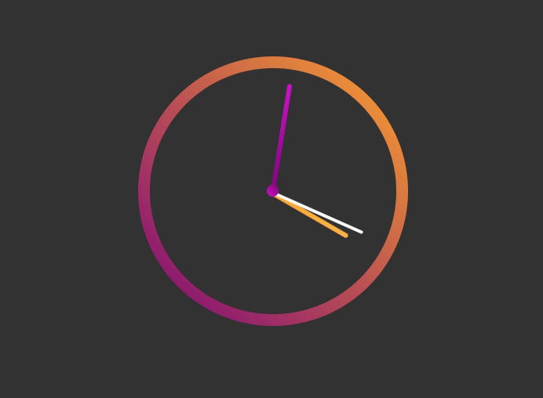

# JS Clock 🕔

✨ #JavaScript30 Project - 02/30 ✨

Clock developed with vanilla JavaScript.

> <a href="https://sabrinabarros.github.io/JavaScript30/02%20-%20JS%20Clock/index.html" target="_blank">Available on GitHub pages.</a>